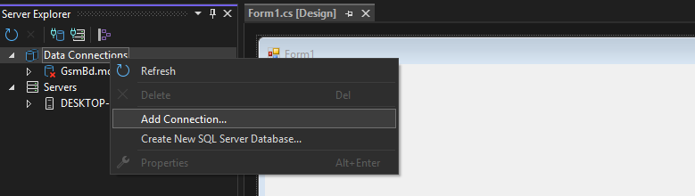
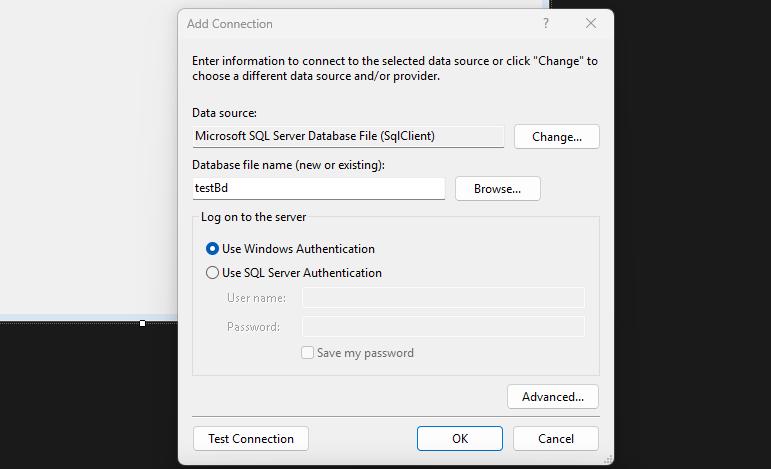
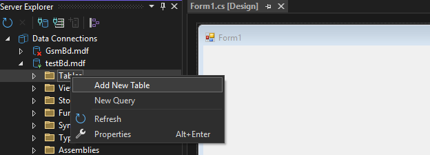
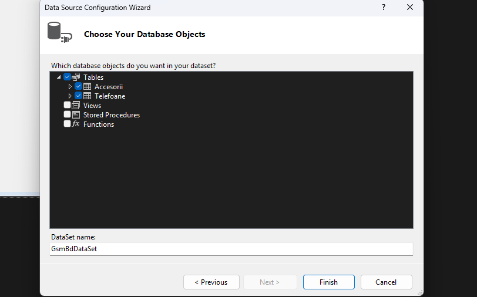
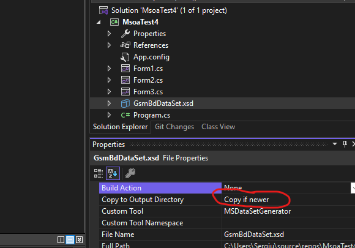

# MSOA-Teste-rezolvate

cum folosesti baza de date in visualstudio C#

- definesti obiectul
  ```C#
     [numele tabelei]TableAdapter adapter[numele tabelei] = new [numele tabelei]TableAdapter();
      //exemplu
     StudentiTableAdapter adapterStudenti = new StudentiTableAdapter();

     //cu ajutorul adapterStudenti putem primi date, insera, update si sterge
     adapterStudenti.GetData();
     adapterStudenti.Insert();
     adapterStudenti.Update();
     adapterStudenti.Delete();
  ```


# 📘 Ghid pentru Crearea unei Baze de Date Locale în Visual Studio

## 1. Deschiderea uneltelor necesare
- `View > Server Explorer`
- `View > Other Windows > Data Sources`

---

## 2. Crearea bazei de date
În fereastra **Server Explorer**:
- Click pe **Add New Connection**
- Configurează noua conexiune

 <!-- înlocuiește cu URL sau path către imagine -->



---

## 3. Crearea tabelelor
- Creează tabelele în baza de date



- Dacă un tabel conține o **cheie externă** (*foreign key*), setează opțiunea:
  ```sql
  ON DELETE CASCADE
  ```
  Exemplu;
  ```sql
  CREATE TABLE [dbo].[Student] (
    [Id] INT PRIMARY KEY IDENTITY(1,1),
    [Nume] NVARCHAR(50) NOT NULL
  );
  
  CREATE TABLE [dbo].[Materii](
      [Id] INT PRIMARY KEY IDENTITY(1,1),
      [Denumire] NVARCHAR(30) NOT NULL,
      [NotaFinala] INT NOT NULL,
      [StudentId] INT NOT NULL FOREIGN KEY REFERENCES Student(Id) ON DELETE CASCADE
  );
  ```
- Astfel, ștergerile vor fi propagate automat în tabelele legate.
- După finalizarea tabelelor, apasă Update pentru a salva modificările.

## 4. Conectarea bazei de date la Form
Deschide formularul (Form)

Mergi la tabul Data Sources

Apasă pe Add New Data Source
Selectează:
- Database
- Dataset
- Next > Next
- Alege tabelele dorite



---
## 5. O mica modificare in setarile bazei de date
din file explorer selecteaza baza de date si in proprietatiile pui:
- Copy to Output Directory pe Copy if newer



este o setare sa sa se salveze in baza de date nu local in \bin\Debug.
